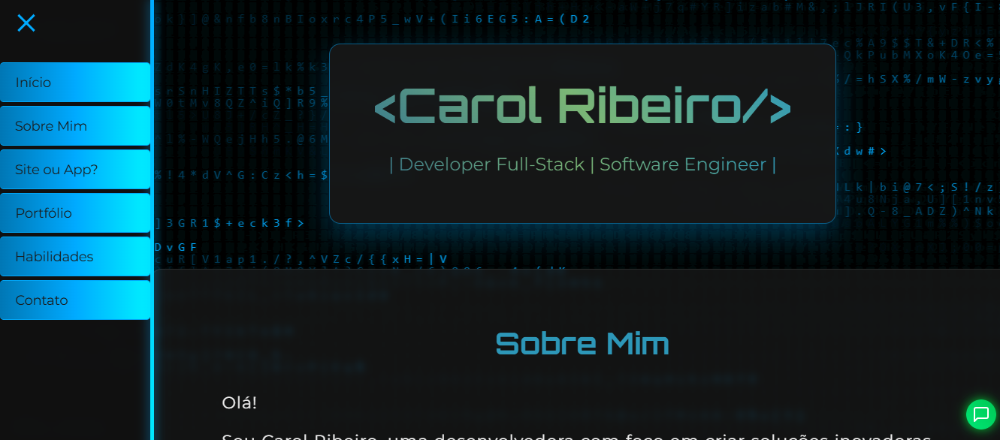
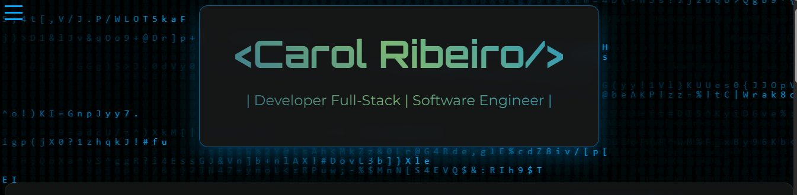

# 💻 Meu Primeiro Site Profissional

Este projeto é um site portfólio pessoal desenvolvido com HTML, CSS e JavaScript, com design moderno, responsivo e pronto para apresentar minhas habilidades e projetos como Desenvolvedora Full Stack.

## 🧠 Sobre o Projeto

O objetivo é oferecer uma vitrine digital para mostrar quem sou, o que faço e como posso ajudar empresas e pessoas a construírem soluções incríveis com tecnologia.

## 🚀 Funcionalidades

- Design moderno e escuro com destaque em neon
- Menu lateral com navegação suave entre seções
- Seções: Início, Sobre Mim, Site ou App?, Portfólio, Habilidades e Contato
- Responsivo (funciona bem em celulares e tablets)
- Botão de chat flutuante
- Modal de formulário de contato (interativo)

## 🛠️ Tecnologias Utilizadas

- HTML5
- CSS3
- JavaScript
- Fontes do Google Fonts
- Ícones do Font Awesome

## 📷 Imagens do Projeto

### Página Inicial  

### Menu Lateral Aberto  

### Banner do Site  

## 📁 Estrutura do Projeto
MEU-PRIMEIRO-SITE/

├── assets/
│ ├── banner.png
│ ├── home-preview.png
│ └── menu-preview.png
├── css/
│ └── style.css
├── js/
│ └── script.js
└── index.html

## 🔗 Acesse o site publicado

[Acesse aqui](https://carolribeiros.com.br)

## 🧑‍💻 Desenvolvido por

**Carol Ribeiro** – Desenvolvedora Full Stack  
[LinkedIn](https://www.linkedin.com/in/carolribeirodev) | [GitHub](https://github.com/CarolRibeiro)

## 📝 Licença

Este projeto está sob a licença [MIT](https://choosealicense.com/licenses/mit/).  
Você pode usar, modificar e distribuir com liberdade, desde que mantenha os créditos ao autor.

---
