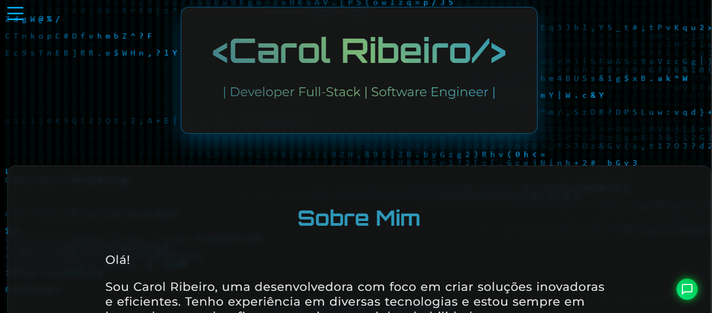

# 💻 Carol Ribeiro - Portfólio Pessoal

Seja bem-vindo(a) ao meu portfólio! Este site foi criado para apresentar minhas habilidades como **Desenvolvedora Full-Stack** e **Engenheira de Software**, além de reunir meus projetos, experiências e formas de contato.

---

## 🚀 Sobre o Projeto

Este é um projeto pessoal desenvolvido com **HTML**, **CSS** e **JavaScript**, com layout moderno, animações suaves e visual tech inspirado em linhas de código. Criado para destacar minha presença profissional online de forma criativa, responsiva e funcional.

---

## ✨ Funcionalidades

- Interface moderna com fundo estilo matrix binária
- Menu lateral interativo e responsivo
- Seções com rolagem suave: Início, Sobre Mim, Portfólio, Habilidades e Contato
- Animações em CSS
- Botão de voltar ao topo
- Modais de contato com formulário funcional
- Links diretos para redes sociais

---

## 🌐 Acesse o Site

📍 [www.carolribeiros.com.br](https://www.carolribeiros.com.br)

---

## 👩‍💻 Tecnologias Utilizadas

- `HTML5`
- `CSS3`
- `JavaScript (ES6+)`
- `Google Fonts` (Orbitron e Montserrat)
- `Git e GitHub`
- `Vercel` (Deploy e hospedagem)

---

## 🖼️ Imagens do Projeto

### Página Inicial

### Menu Lateral Aberto

---

## 🛠️ Como Executar Localmente

1. Clone o repositório:
    git clone https://github.com/CarolRibeiro/seu-repositorio.git

2. Acesse o diretório do projeto:
    cd seu-repositorio

3. Abra o arquivo index.html no navegador:
    No VS Code, clique com o botão direito em index.html > Open with Live Server
    Ou apenas dê um duplo clique no arquivo para abrir no navegador

📁 Organização de Pastas

📦 projeto/
├── assets/              # Imagens usadas no site
├── css/
│   └── style.css        # Estilo do site
├── js/
│   └── script.js        # Scripts do site
├── index.html           # Página principal
└── README.md            # Arquivo de documentação

📝 Licença
Este projeto está sob a licença MIT — isso significa que você pode usar, modificar e distribuir à vontade, desde que mantenha os devidos créditos.

📬 Contato
Entre em contato comigo pelas redes sociais:

📧 Email: anacarolina.ribeiro.s@gmail.com
🔗 LinkedIn
🐙 GitHub
📸 Instagram

✨ Obrigada por visitar meu portfólio!
